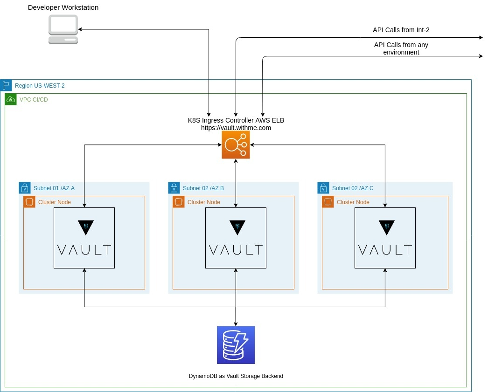

# Hashicorp Vault



Vault is a tool for securely accessing secrets. A secret is anything that you want to tightly control access to, such as API keys, passwords, or certificates. Vault provides a unified interface to any secret, while providing tight access control and recording a detailed audit log.

* Elements
  * AWS DynamoDB (As a storage)
  * AWS KMS Key (Unseal keys keeper)
  * Hashicorp Vault

## Deploy AWS DynamoDB and AWS KMS key with CloudFormation template

At first make sure that you "build" user:

```bash
$aws sts get-caller-identity --output text
```

Make sure that you in `./hashicorp-vault` directory!

```bash
$ pwd
/your/pc/path/to/repo/env-cicd/hashicorp-vault
```

**./cloudformation-vault-dependencies.yaml already have some default values and descriptions for every parameter in CF template I recommend to read them before start deploy.**

CloudFormation template default Parameters:

```bash
NodeInstanceRoleName=env-cicd-cicdUtil-1O9RL11256YZE-NodeInstanceRole-3ERU7WZVH3EF
NodeInstanceRoleARN=arn:aws:iam::407733091588:role/env-cicd-cicdUtil-1O9RL11256YZE-NodeInstanceRole-3ERU7WZVH3EF
```

Initiate CloudFormation stack creation by command:

```bash
aws cloudformation create-stack --region us-west-2 --stack-name vault-aws-resources --template-body file://cloudformation-vault-dependencies.yaml --capabilities CAPABILITY_IAM
```

You can check stack status on AWS Web Console CloudFormation page or after stack creation command run:

```bash
aws cloudformation wait stack-create-complete --stack-name vault-aws-resources
```

In Stack Output you will find "KMSvaultKeyID" and "DynamoDBtableName" we will use them in Helm Install command.

## Deploy Hashicorp Vault

1. Add Artifactory Helm Repository to your Helm Charts

     ```$ helm repo add ego-helm-release https://withme.jfrog.io/withme/ego-helm-release/ --username $ARTIFACTORY_USERNAME --password $ARTIFACTORY_PASSWORD```

2. Update chart list from Helm Repositories

     ```$ helm repo update```

3. Change directory to monitoring tier directory

     ```$ cd /home/$USER/env-cicd/hashicorp-vault```

4. Check active "kubectl" cluster

     ```$ kubectl config current-context```

5. Deploy "Hashicorp Vault" to EKS cluster

     ```$ helm install vault-ha ego-helm-release/vault -f ./vault-hashicorp-values.yaml -n vault```

6. Check that Vault running without issues

     ```bash
     $kubectl get po -n vault
     $helm status vault-ha
     $helm get vault-ha
     ```
